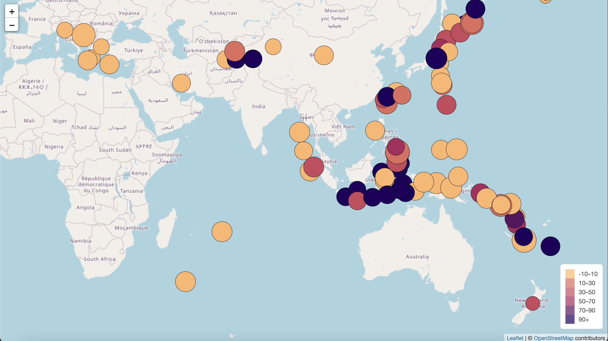
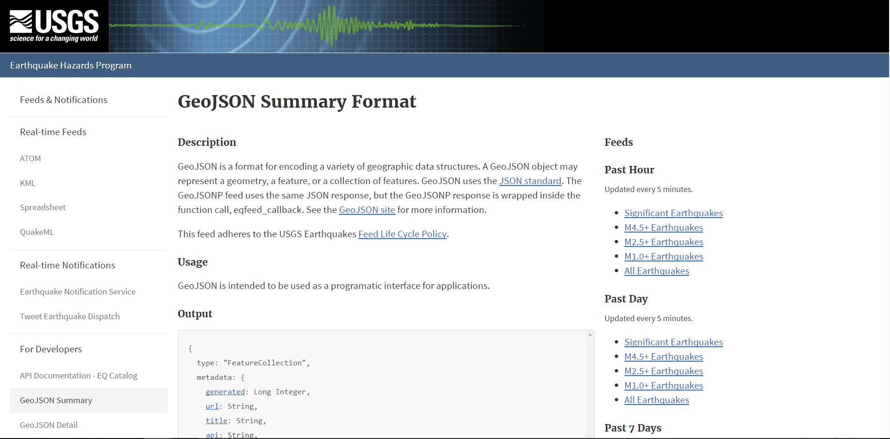
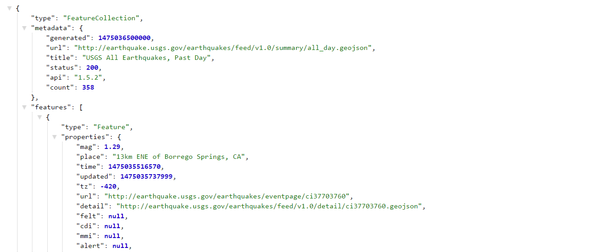

# leaflet-challenge

This is the repository for Monash University Data Analytics Bootcamp Module 15 Challenge

## Contents

`index.html` file is the main HTML file that structures the earthquake visualisation

**static folder**
* `js` folder contains `app.js` JavaScript file responsible for adding interactivity and functionality to the earthquake visualisation
* `css` folder contains `styles.css` file that styles the earthquake visualisation

## Background 

The United States Geological Survey, or USGS for short, is responsible for providing scientific data about natural hazards, the health of our ecosystems and environment, and the impacts of climate and land-use change. Their scientists develop new methods and tools to supply timely, relevant, and useful information about the Earth and its processes.

The USGS is interested in building a new set of tools that will allow them to visualise their earthquake data. They collect a massive amount of data from all over the world each day, but they lack a meaningful way of displaying it. In this challenge, you have been tasked with developing a way to visualise USGS data that will allow them to better educate the public and other government organisations (and hopefully secure more funding) on issues facing our planet.

## Instructions

## Create the Earthquake Visualisation

Your first task is to visualise an earthquake dataset. Complete the following steps:

1. Get your dataset. To do so, follow these steps:

* The USGS provides earthquake data in a number of different formats, updated every 5 minutes. Visit the USGS GeoJSON FeedLinks to an external site. page and choose a dataset to visualise. The following image is an example screenshot of what appears when you visit this link:

* When you click a dataset (such as "All Earthquakes from the Past 7 Days"), you will be given a JSON representation of that data. Use the URL of this JSON to pull in the data for the visualisation. The following image is a sampling of earthquake data in JSON format:

 

2. Import and visualise the data by doing the following:

* Using Leaflet, create a map that plots all the earthquakes from your dataset based on their longitude and latitude.

    * Your data markers should reflect the magnitude of the earthquake by their size and the depth of the earthquake by colour. Earthquakes with higher magnitudes should appear larger, and earthquakes with greater depth should appear darker in colour.

        **Hint:** The depth of the earth can be found as the third coordinate for each earthquake.

* Include popups that provide additional information about the earthquake when its associated marker is clicked.

* Create a legend that will provide context for your map data.

* Your visualisation should look something like the preceding map.

## Requirements

**Map (60 points)**
    
* TileLayer loads without error (20 points)

* Connects to geojson API using D3 without error (20 points)

* Markers with size corresponding to earthquake magnitude (10 points)

* A legend showing the depth and their corresponding colour (10 points)

**Data Points (40 points)**

* Data points scale with magnitude level (10 points)

* Data points colours change with depth level (10 points)

* Each point has a tooltip with the Magnitude, the location and depth (10 points)

* All data points load in the correct locations (10 points)

## Resources

BCS Xpert Learning assistant

https://leafletjs.com/examples/quick-start/

https://gis.stackexchange.com/questions/364892/set-center-coordinate-for-leaflet-tilelayer-mask-layer

## Acknowledgments 

* Datasets provided by edX Boot Camps LLC.
* Dataset created by the United States Geological Survey